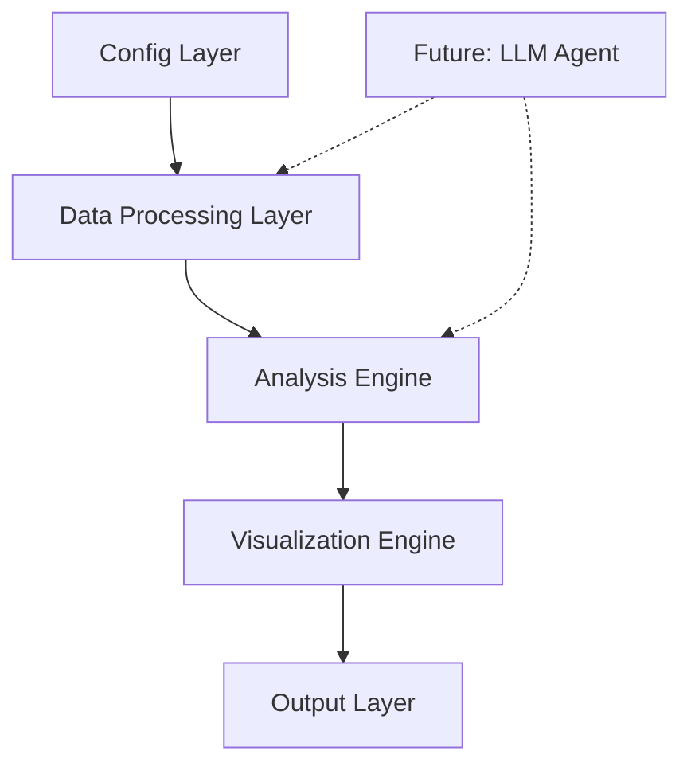

# System Architecture

## High-Level Design

## Core Components

### 1. Configuration Layer
- [`config/metrics.yaml`](../config/metrics.yaml): Metric definitions and properties
  - Defines metrics to monitor
  - Specifies hypothesis associations
  - Sets metric properties (e.g., higher_is_better)
- [`config/hypotheses.yaml`](../config/hypotheses.yaml): Hypothesis configurations
  - Defines hypothesis types and evaluation criteria
  - Specifies input data requirements
  - Sets scoring parameters

### 2. Data Processing Layer
- [`src/data_processor.py`](../src/data_processor.py): Data loading and preprocessing
- Key Class: `DataProcessor`
  - Handles data validation
  - Performs initial cleaning
  - Manages region mapping
  - Prepares data for analysis

### 3. Analysis Engine
- [`src/automation_pipeline.py`](../src/automation_pipeline.py)
- Key Classes:
  - `RootCauseAnalysisPipeline`: Main orchestrator
    - Coordinates analysis flow
    - Manages hypothesis evaluation
    - Handles result aggregation
  - `EvaluateHypothesis`: Core analysis logic
    - Implements scoring algorithm
    - Detects anomalies
    - Evaluates hypotheses

### 4. Visualization Engine
- [`src/visualization.py`](../src/visualization.py)
- Key Class: `RCAVisualizer`
  - Creates standardized visualizations
  - Supports multiple visualization modes
  - Handles score component visualization
  - Manages plot layouts and styling

### 5. Output Layer
- [`src/presentation.py`](../src/presentation.py): Report generation
  - PowerPoint/Google Slides generation
  - Future: Dashboard integration interfaces
  - Configurable output formats

## Future Architecture Considerations

### 1. LLM Integration
- Agent-based decision making
- Natural language reasoning
- Hypothesis selection and ranking

### 2. Extensible Framework
- Modular visualization components
