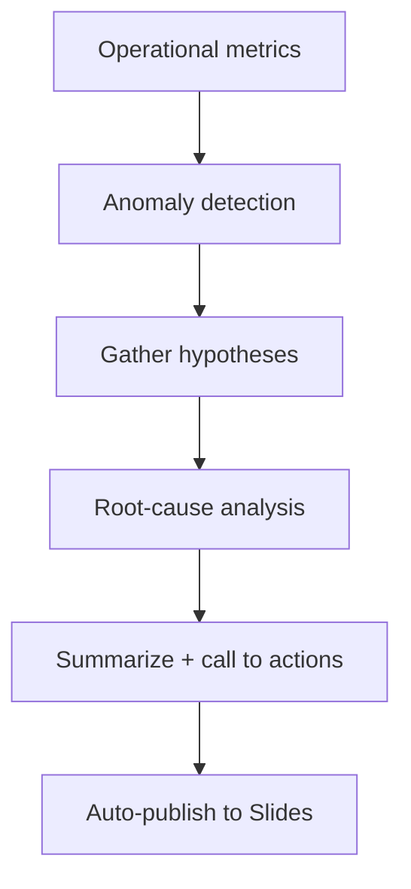

# 1 · Status
> Only "Directional" hypothesis are root-cause and can be directly comparable. The rest are more "descriptive". They add visuals but how exactly do they compare to the rest requires further ranking. 

| Metric layer       | Hypothesis type                                                   | Output today                   |
| ------------------ | ----------------------------------------------------------------- | ------------------------------ |
| L4 Operational KPI | [[directional\|Directional]] (ranked score)                       | ✔ auto‑refresh into WBR slides |
|                    | [[depth-spotter\|Depth‑spotter]] (lagging / outperforming L8)     | ✔ auto‑refresh into WBR slides |
|                    | [[Product‑mix]] (index vs ROW)                                    | in Bento Notebook              |
|                    | [[Reason‑mix]] (these reasons are abnormally high in this region) | in Bento Notebook              |
|                    | [[Product‑vertical fit]]                                          | in Bento Notebook              |
|                    | [[Oaxaca‑Blinder\|Mix‑vs‑Efficiency decomposition]]               | in Bento Notebook              |

---

## 2 · Root-Cause Hypothesis Types

### 2.1 [[directional|Directional]] ("D‑score")

Most common, fully standardized – works when KPI and hypothesis can be **ranked & compared across regions**.

**Scoring formula** 

```python
final_score = 0.6*direction_alignment \
            + 0.4*explained_ratio
explains = final_score > 0.5
```

| Component       | Meaning                            | Implementation                                              |
| --------------- | ---------------------------------- | ----------------------------------------------------------- |
| Sign Agreement  | Metric & hypo move in expected dir | `score_sign = (regions where sign(Δmetric)==sign(Δhypo))/n` |
| Explained ratio |                                    | min(Δ\_h/Δ\_m,1)                                            |
Output:  **Ranked Bar chart (based on hypothesis score) with Callout Texts for the highest-score hypothesis (call that root-cause)**

---

### 2.2 [[depth-spotter|Depth‑spotter]]

*What*: slice KPI → L8; flag pockets ±1 σ from region mean.
*Why*: identifies **which sub‑markets actually drag L4**.

*Output*: bar chart of L8s, colored lag vs out‑perform.


---

### 2.3 Mix‑vs‑Efficiency ([[Oaxaca‑Blinder]])

*Use‑case*: How much % of gap is due to better/worse composition, and how much is driven by performance?
*Breaks total gap into*
* **Mix / Composition** (employee job level mix, book construct revenue mix)
* **Efficiency** (within‑cell conversion).

Formula:
`Δ_total = Σ(mix_R−mix_ROW)·rate_ROW + Σ mix_R·(rate_R−rate_ROW)`

Visual: 2‑bar waterfall.

---

### 2.4 Product‑mix index

*What*: region’s win‑rate per product vs ROW baseline.
Outputs green/red index (>1 good, <1 needs review).
Helps answer: *“Switch 5 % pitches from P3 to P1 gives +1 pp uplift.”*

---

### 2.5 Reason‑mix (closed‑lost or closed-won reasons)

% difference & dollar loss by AM‑tagged reason → categorical uplift table.

---

### 2.6 Product‑vertical fit

1. Build global **product × vertical** win‑rate map (cells with wins ≥ 30).
2. Keep top‑k cells per vertical (best‑fit set).
3. Compare each region’s mix & within‑cell rates.
4. Simulate uplift if region re‑allocates 5–10 % pitches to best‑fit.

Visual: heatmap 
_+ waterfall (mix vs exec vs potential uplift)_.

---
## 3 ·Ideas for Next Phase 

[[Slide = "story", Unidash = "evidence & self‑service"]]
[[pacing-adjusted baseline via comparing to region's own historical progress]]
[[pivot from the % stage view to?]]
[[stage-specific Sankey chart]]
[[BHB decomposition for change drivers (in time)]]
[[BHB decomposition for exits (in stage)]]
[[define gap to goal?]]

# 2 · Slides

## Problem Statement

- Current “RCA” work is **reactive & ad-hoc** – leadership spots an odd metric, analysts scramble to pull data and guess why.
    
- WBR & DCMP dashboards overflow with numbers; they surface **what** happened but never the **insight** or **action**.
    
- We need an **automation engine** that turns a dense data library into a one-pager TL;DR:
    
    _“Metric A/B is off; here’s the top reason and next step.”_
    
- Guiding idea: “He who has a _why_ can bear almost any _how_.” Automating the _why_ shrinks the gap from data to action (gap to goal).

## The Solution: Live Demo of RCA


**Insight modules now shipping**

- Directional & sub-region deep dives (ranks root causes, injects “what to do”)
- Book-construct / AM-level mix (client size & rep seniority)
- Product vs AM skill split (inventory quality vs execution)
- Product-vertical fit (mismatched assignments)
- Closed-reason mix (abnormal win/loss tags → corrective levers)

## Timeline 

March: Collect hypotheses; build metric-hypothesis DB
April: Group hypotheses; design ranking & action logic
May: Slide generator v1: dynamic auto-layout

June: Polish RCA; add pacing module
July: Push to Unidash; LLM-written summaries & actions

## Hypotheses Groups for ranking, reasoning, and call to action

| **Group**                  | **What it asks**                          | **Example insight / action**                             |
| -------------------------- | ----------------------------------------- | -------------------------------------------------------- |
| **Directional root-cause** | “If A ↓ then Z ↑?”                        | NA AMs link fewer KIs → highest Closed-Lost              |
| **Depth spotter**          | Which sub-region moves the needle?        | MENA, Benelux, Gaming drive 70 % of EMEA win gap         |
| **Construct mix**          | Does mix (book, AM, product) explain gap? | Shift 10 % pipeline to high-win products → +$Y revenue   |
| **Tagged reasons**         | Which close reasons spike?                | “Meta Resources $” tag in NA is 2× ROW → need resourcing |
| **Pacing / pipeline**      | Is region just late in normal ramp?       | LATAM behind curve → false alarm not under-perf          |

## Directional Root-Cause (Sign-Agreement Ranking)
> _rank competing hypotheses for an anomalous region

**1 · Benchmark — start with a common yard-stick**

Compare each region’s KPI to the **Global average**: turn raw numbers into simple “+ / –” deltas we can line-up across every hypothesis.

**2  · Ranking math — turn many signals into one score**

| Term                     | Formula                                                                                    | Purpose                                                                                     |
| ------------------------ | ------------------------------------------------------------------------------------------ | ------------------------------------------------------------------------------------------- |
| **Sign-match rate**      | $\text{rate} = \dfrac{\#\{\operatorname{sign}\Delta M = \operatorname{sign}\Delta H\}}{n}$ | Did the KPI–hypothesis movement match the direction SSPO expects (same or opposite)?        |
| **Explained ratio**      | $\text{ratio} = \min\!\bigl(\lvert\Delta H_a\rvert / \lvert\Delta M_a\rvert,\,1\bigr)$     | At the anomaly region, how much of the KPI gap the hypothesis size can cover (capped at 1). |
| **Base score**           | $0.6\times\text{rate} + 0.4\times\text{ratio}$                                             | Direction + size, 0-1 scale                                                                 |
| **Actionability weight** | 1 = neutral · >1 = boost                                                                   | Manual lever to favour fixes we can pull                                                    |
| **Final score**          | $\text{Base} \times \text{Actionability}$                                                  | The single number we rank on.                                                               |
**3 · Story — why this matters**
By scoring every hypothesis the same way, we avoid opinion battles. Honor SSPO’s _expected_ relationships, then reward hypotheses that both match reality **and** are feasible levers.

Actionability weight makes sure “easy fixes” bubble to the top even if they’re slightly less explanatory.

**4. Example — six competing hypotheses for NA**

| Rank | Hypo ID | Sign-match | Explained ratio | Actionability w | **Final score** |
| ---- | ------- | ---------: | --------------: | --------------: | --------------: |
| ①    | **C**   |       0.76 |            0.98 |        **1.30** |        **1.10** |
| ②    | B       |       0.83 |            0.95 |            1.10 |            0.97 |
| ③    | E       |       0.65 |            0.90 |            1.20 |            0.90 |
| ④    | F       |       0.79 |            0.76 |            1.05 |            0.82 |
| ⑤    | A       |       0.73 |            0.72 |            1.00 |            0.73 |
| ⑥    | D       |       0.73 |            0.69 |            0.90 |            0.64 |

> **Insight / Action** Hypothesis **C** (highest actionable lever) best explains the KPI gap in NA compared to Global — prioritize it in the deck and follow-up plan.

---

## Depth Spotter (Coverage × Contribution)
>find which L8 slices drive the region’s gap

**1 · Benchmark — Rest of World (RoW) as the mirror**

Inside the flagged region, each slice’s KPI is compared to the **Rest-of-World (18 %)**: isolate local over- or under-performance from global trends.

**2 · Ranking math — coverage × contribution**

| **Term**         | **Plain-English meaning**                                       |
| ---------------- | --------------------------------------------------------------- |
| **Coverage**     | Share of CLIs the slice owns (size of the pie piece).           |
| **Contribution** | How much that slice moves the region gap up or down (Σ = ±1).   |
| **Score**        | Rewards slices that move the gap more than their size suggests. |

**3 · Story — what the numbers tell us**

Coverage says _how big_ the slice is; contribution says _how guilty or heroic_ it is.
The score blends both, so a niche slice with a giant delta can still top the list.

**4 · Example (EMEA, 1 000 CLIs total)**

* Region **EMEA** flagged as high win-rate (+3 pp vs. ROW).

| **Slice**  | **CLIs**  | **Wins** | **Obs %** | **ExpWins** | **Contr** | **Score** | **Narrative takeaway**                            |
| ---------- | --------- | -------- | --------- | ----------- | --------- | --------- | ------------------------------------------------- |
| **Gaming** | 150       | 50       | 33 %      | 27          | **+0.77** | **2.21**  | _Small slice, outsized lift — replicate tactics._ |
| MENA       | 400       | 90       | 23 %      | 72          | +0.60     | 1.05      | Volume lift; keep momentum.                       |
| Benelux    | 200       | 26       | 13 %      | 36          | –0.33     | 1.00      | _Key drag — coach first._                         |
| Nordics    | 250       | 44       | 18 %      | 45          | –0.03     | 0.18      | Near-neutral.                                     |
| **Σ **     | **1 000** | **210**  | 21.0 %    | **180**     | **+1.00** | —         | —                                                 |

> **Insight / Action**
 > - Double-down on _Gaming_ tactics across EMEA.
>  - Fix _Benelux_ execution gaps to reclaim one-third of the lost wins.
    
_The same framework works for additive KPIs—swap Wins/CLIs with Revenue or CI count and re-run the sheet._
## Construct Mix, Using Decomposition
> “Is the gap driven by the book construct, or how well we pitch?” 

**1 · Benchmark — Rest of World (RoW) as the mirror**

Break Region R’s win-rate into the same **Book or AM-level grid** used worldwide.
ROW cell rates serve as the neutral yard-stick.

**2 · Decomposition math — one gap, two levers**

| **Term**                     | **Formula**                                                                     | **Plain-English meaning**                                                                                                                                |
| ---------------------------- | ------------------------------------------------------------------------------- | -------------------------------------------------------------------------------------------------------------------------------------------------------- |
| **Mix gap (Δ mix)**          | $\sum ( \text{mix}_{R,i} - \text{mix}_{ROW,i} ) \times \text{rate}_{ROW,i}$     | Wins gained or lost **because we pitch a different mix** of client-cells or AM levels.                                                                   |
| **Performance gap (Δ perf)** | $\sum \text{mix}_{R,i} \times ( \text{rate}_{R,i} - \text{rate}_{ROW,i} )$      | Wins gained or lost **inside the same cells** (execution efficiency).                                                                                    |
| **Total gap**                | $\Delta_{\text{mix}} + \Delta_{\text{perf}}$                                    | Region-to-ROW win-rate difference.                                                                                                                       |
| **Driver share**             | $\text{share}_k = \lvert \Delta_k \rvert / \lvert \Delta_{\text{total}} \rvert$ | Portion of the gap explained by each component. <br>• ≥ 70 % ⇒ *dominant driver* (composition or performance). <br>• Opposite signs ⇒ *offsetting* case. |

> This decomposition is applied to **Book construct** (client-size mix) and **AM construct** (seniority mix). 


**3 · Why it matters**

A big composition gap means we can fix the score by **re-balancing the book**;
a performance gap means we need **training or process changes**.

**4 · Example — Region NA vs. ROW**

| **Gap component**        | **Value (pp)** | **Share of total** | **Narrative takeaway**               |
| ------------------------ | -------------- | ------------------ | ------------------------------------ |
| **Mix (Δ mix)**          | **+2.0**       | 29 %               | More high-revenue clients            |
| **Performance (Δ perf)** | **–5.0**       | 71 %               | Lower close-rate _within_ every cell |
| **Net gap**              | –3.0           | 100 %              | Overall under-performance            |
Dominant driver = **performance** (71 %).

_Favorable book adds +2 pp, but execution leaks –5 pp._

  
**5 · Insight / Action**

- **Tighten execution**: run win-loss workshops for AMs, refresh pitch scripts.
- Keep the strong book mix; shifting clients would _worsen_ the gap.

## Product Mix (Performance Index)

> Is NA better because it pitches easier products, or because its AMs close better?

**1 · Benchmark — Rest of World (ROW) as the mirror**
Use ROW win-rate for each product as the neutral yard-stick.

**2 · Analysis math — one flow, two levers**

| **Term**                  | **Formula**                                                        | **What It Shows**                                               |
| ------------------------- | ------------------------------------------------------------------ | --------------------------------------------------------------- |
| Expected rate             | $\hat{r}_R = \sum \text{mix}_{R,i} \cdot \text{rate}_{ROW,i}$      | Region’s score if it executed like ROW                          |
| Mix effect (Δ mix)        | $\hat{r}_R - r_{ROW}$                                              | Gap from pitching a different product mix                       |
| Execution effect (Δ exec) | $r_R - \hat{r}_R$                                                  | Gap from closing better/worse inside products                   |
| Performance index₍ᵢ₎      | $\text{rate}_{R,i} / \text{rate}_{ROW,i}$                          | How product _i_ performs vs. ROW (>1 = good)                    |
| Weighted impact₍ᵢ₎        | $\text{mix}_{R,i} \cdot (\text{rate}_{R,i} - \text{rate}_{ROW,i})$ | How much product _i_ contributes to region’s gap                |
| Correlation r             | ρ(expected, actual) across all regions                             | High (+0.5) → mix drives gaps; low/neg → execution drives gaps. |

**3 · Story — how to read the numbers**

1. Split the gap into “right products” (mix) vs. “better closing” (execution).
2. **Correlation r** tells which lever dominates across regions.
3. **Weighted impact** ranks products so we know exactly *what* to shift or fix.

**4 · Example — Region NA (Closed-Won %)**

| **Product** | Mix diff<br>(pp) | NA win % | ROW win % | **Weighted impact** | Narrative takeaway        |
| ----------- | ---------------: | -------: | --------: | ------------------: | ------------------------- |
| **Prod A**  |             +6.0 |     32 % |      24 % |        **+1.44 pp** | Big lift; scale pipeline. |
| Prod B      |             –4.0 |     18 % |      25 % |            –0.28 pp | Leak; retrain playbook.   |
| Prod C      |             +2.0 |     27 % |      21 % |            +0.12 pp | Mild positive.            |

Region gap vs. ROW = **+1.3 pp**
• Δ mix = **+1.0 pp** • Δ exec = **+0.3 pp** • ρ = **+0.64** ⇒ **mix-driven**

**5 · Insight / Action**

* **Re-allocate pipeline** toward *Prod A*—already 6 pp overweight and 1.4× ROW win-rate.
* Patch execution leak on *Prod B* (–0.28 pp impact) via targeted coaching.
* The remaining 0.3 pp gap stems from execution; address with win-loss reviews.


## Product-Vertical Fit (Adoption & Lift Index)
> Are we pitching the right product for each vertical, and how big is the lift if we fix it? Find products that inherently match local verticals better.

**1 · Benchmark — ROW win-rate grid**

Use Rest-of-World win-rate for every *(product, vertical)* as the neutral yard-stick.

**2 · Analysis math**

| Term                  | Formula                                                         | What it tells us                                      |
| --------------------- | --------------------------------------------------------------- | ----------------------------------------------------- |
| **Best product(s)**   | top-win-rate products in a vertical (≥ `min_initiatives`)       | Gold standard AMs should pitch.                       |
| **Adoption %**        | CLIs on best ÷ all CLIs in vertical                             | How often the region chooses the right product.       |
| **Expected win-rate** | $\hat r_R = \sum (\text{mix}_{R,i} \times \text{rate}_{ROW,i})$ | Region’s score if it executed like ROW.               |
| **Execution effect**  | $r_R - \hat r_R$                                                | Extra wins (+) or leak (–) inside products.           |
| **Lift pp**           | $(\text{best} - \text{current}) \times (1 - \text{adopt%})$     | Point-lift if region switches its remaining pipeline. |
| **Lift Index**        | previous × vertical-mix %                                       | Dollar / volume impact; used to rank.                 |

### 3 · Story — reading the output

High ρ(adoption, win %) ⇒ *fit* drives performance; low / negative ρ ⇒ *execution* dominates.

### 4 · Example layout (placeholder numbers)

| Vertical (mix %) | Adoption range | Top lift action                     | **Lift pp** |
| ---------------- | -------------: | ----------------------------------- | ----------: |
| **Retail (7 %)** |        15–68 % | EMEA: switch *Prod B → Prod A*      |    **+2.3** |
| Tech (5 %)       |        20–60 % | LATAM: adopt *Prod X* best practice |        +1.5 |
| …                |              … | …                                   |           … |

### 5 · Insight / Action

* Raise Reels adoption in EMEA to **≥ 50 %** in EMEA & LATAM → **+\$X lift**.
* Standardize best-product playbooks where adoption variance > 20 pp.
* Re-check monthly; flag verticals where execution, not mix, is the bigger leak (ρ < 0.3).


## Tagged Reason Mix v 1.0 (Over-index Ratio)
> Which close-reason tags pop out in the anomalous region, and what’s the exposure ($ revenue)?

**1 · Benchmark — the rest vs. anomalous**

Use Rest-of-World reason mix % as the neutral yard-stick.

**2 · Analysis math**

|**Term**|**Formula**|**Meaning**|
|---|---|---|
|**Share %**|deals_reason / deals_total|Tag prevalence|
|**Δ pp**|Share%_anomaly − Share%_rest|Gap in pts|
|**Over-index ratio**|Share%_anomaly ÷ Share%_rest|Scale (>1 pops)|
|**Excess count**|actual − expected|Extra deals citing tag|
|**Excess $**|actual$ − expected$|Rev at stake|

**3 · Story — read the table**

Tags with **large Δ pp** **and** big **Excess $** are red-alert.

If another region out-performs on that tag (heat-map), copy its playbook.

**4 · Example (NA lost deals)**

| **Reason**               | **% total (vs base)** | **Count (vs exp)** | **$ impact**        |
| ------------------------ | --------------------- | ------------------ | ------------------- |
| **Meta Resource Issues** | 11 % (+6 pp)          | 330 (140)          | $ 9.0 M (+ $4.0 M)  |
| ...                      | 14 % (+4 pp)          | 420 (280)          | $ 12.0 M (+ $8.0 M) |

**5 · Insight / Action**

- Meta Resource Issues drives NA loss gap — triage capacity vs. speed (coming in v 2.0).


---

## Tagged Reason Mix v 2.0 (Lift$ due to Relationship, Performance + Drill at Product-Vertical Level)**
> Cluster tags into business buckets, price them in $, and pinpoint where they bite.

**1 · Benchmark — same “the rest” baseline**

Now calculated on **bucket** shares at **region × product × vertical** grain (slice ≥ 50 deals).

**2 · Upgrades**

| **Workstream**                                | **What we’ll deliver**                                                | **How we’ll do it**                                                                                                                                                                                           |
| --------------------------------------------- | --------------------------------------------------------------------- | ------------------------------------------------------------------------------------------------------------------------------------------------------------------------------------------------------------- |
| **1. Dollarise “Relationship / Performance”** | Each tag shows **$-impact** as well as % share.                       | • Build trust uplift model (logit on win vs touches, tenure, latency).<br>• Δwin % × avg deal $ → Lift Index $<br>• Pipe into RCA as relationship\$, performance\$.                                           |
| **2. Product × Vertical drill**               | Reason-mix tables at **product × vertical** grain (slice ≥ 50 deals). | • Extend aggregation to (region, product, vertical).<br>• Flag “Advertiser Limitation / Product Limitation / Meta Resource Issues” drivers to owning PMs.<br>• Auto-surface in RCA when sample threshold hit. |

**Impact once shipped**
- $ value attached to soft reasons → easier ROI conversations.
- Capacity vs Speed split pinpoints which Meta teams to staff.
- Product-vertical view lets PMs see exactly where fit breaks down.

## Pacing / Pipeline 

**Pacing / Pipeline:** 
*stage-velocity detector*: quantify where pipeline stalls, distinguish true under-performance from late movers, and point managers to the stage that needs intervention.

Directional + Pacing: velocity gate, pacing curve

## Infra, Logic Layer: "RCA_package"
> Config-driven engine that **runs, ranks, and stores** every hypothesis.

| **Automation**                                          | **Flexible Granularity**                                        | **Deterministic + Extensible**                                     |
| ------------------------------------------------------- | --------------------------------------------------------------- | ------------------------------------------------------------------ |
| YAML / config-driven                                    | Fully parameterized queries                                     | Versioned, deterministic outputs                                   |
| No-code edit needed for new metric-hypothesis pairs     | Today: L4 -> L8 drill-downs, for MM; <br>Ready: L8→L12, for SBG | Same stored results can feed Slides, Unidash, or API without rerun |
| New hypotheses auto-run, rank, and surface side-by-side | Easy switch for grain / market change                           | LLM-ready summarizer layer adds custom prose & reasoning           |

## Infra, Delivery Layer: "slide-generator"
> One-call engine turns any notes + plots into formatted Slide decks—minimal manual Slide-building work, fully extensible.

**Core engine (live)**
- Auto-layout titles, paragraphs, tables, images; paginates when space runs out.
- Smart defaults: alt-row shaded tables, width-capped images, corporate theme.
- Turnaround: minutes to deck, hours of formatting saved.

**Next lift (road-map)**

| **Workstream**         | **What ships**                                                | **ETA** |
| ---------------------- | ------------------------------------------------------------- | ------- |
| **Markdown blocks**    | Bold/italic, headers, lists, code render directly.            | Q3-W1   |
| **Unified layout DSL** | ::: columns + YAML front-matter → define text size and layout | Q3-W3   |
